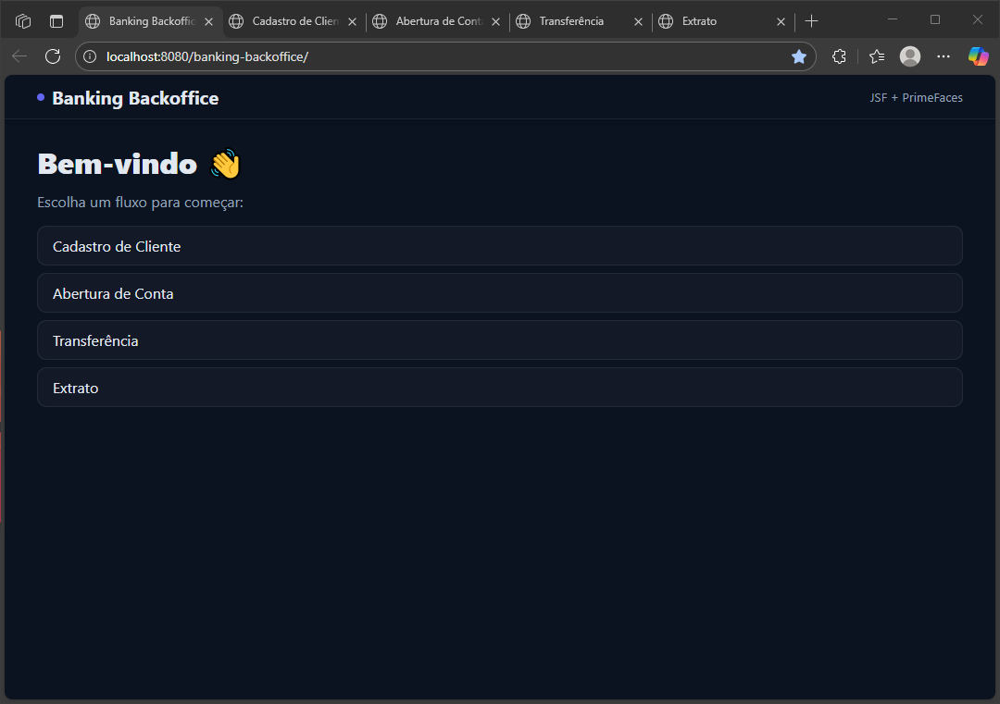
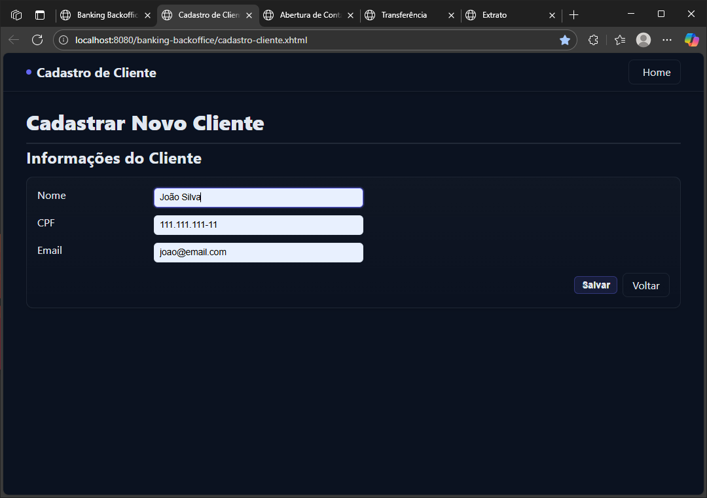
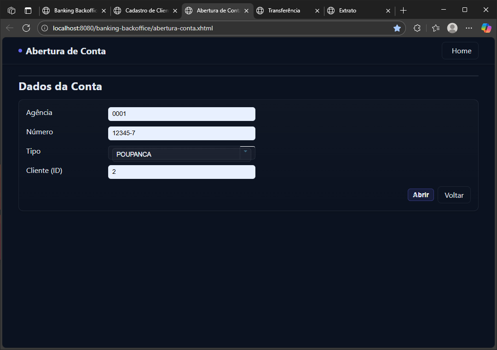
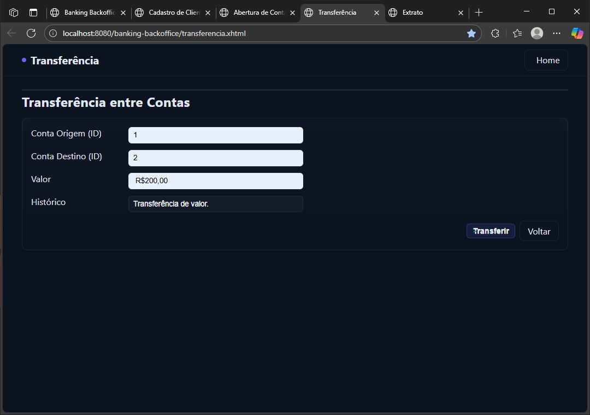
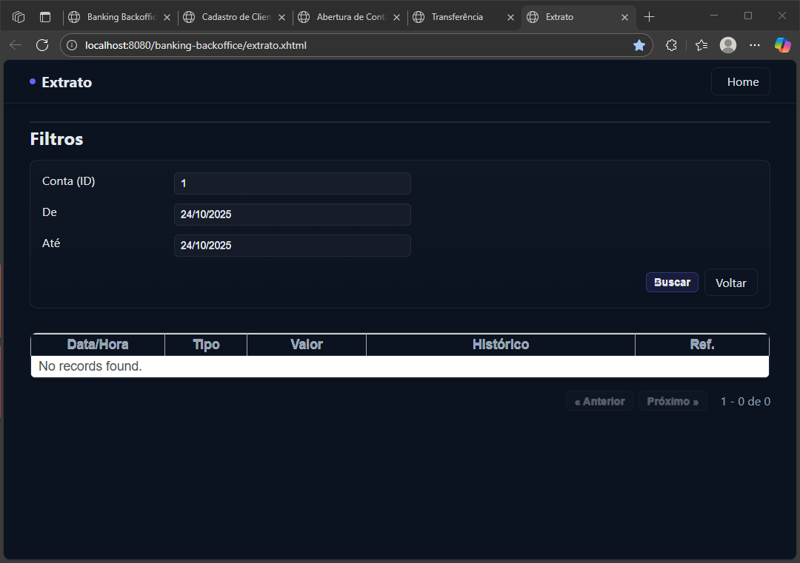

# Banking Backoffice — JSF + PrimeFaces + CDI + JPA

Aplicação web didática de **backoffice bancário** construída com **JSF/PrimeFaces**, **CDI (Weld)** e **JPA/Hibernate**.  
O projeto demonstra camadas bem definidas (Controller/Service/Repository), transações via interceptor CDI, validações Bean Validation, consultas com **Criteria API**, conversores JSF e um **tema dark/compacto** customizado em CSS.

## ✨ Funcionalidades

- **Cadastro de Cliente** (nome, CPF, e-mail, data de cadastro)
- **Abertura de Conta** (agência, número, tipo, cliente)
- **Transferência entre Contas** (débito/crédito com referência única)
- **Extrato com paginação** e filtros por período
- **Validações** (Bean Validation / Hibernate Validator) e mensagens amigáveis no UI
- **Dados iniciais** (seed) carregados via `META-INF/sql/dados-iniciais.sql`
- **Estilo Dark + Modo Compacto** para inputs e botões (PrimeFaces)

## 🧱 Stack e versões

- Java EE / Jakarta (JSF, CDI, JPA)
- **PrimeFaces** (componentes UI)
- **CDI (Weld)** — injeção de dependências e interceptores
- **JPA/Hibernate** — mapeamento ORM e Criteria API
- **MySQL** — banco relacional
- **Tomcat** — servlet container (deploy WAR)
- **Maven** — build e empacotamento

> O `persistence.xml` aponta para **MySQL** e está configurado para **drop-and-create** (gera o schema do zero a cada subida, apenas para desenvolvimento).

## 📁 Estrutura do Projeto (resumo)

```
src/
├─ main/java/com/bank/backoffice/
│  ├─ controller/         # JSF Managed Beans (@Named @ViewScoped)
│  │   ├─ AberturaContaBean.java
│  │   ├─ CadastroClienteBean.java
│  │   ├─ ExtratoBean.java
│  │   └─ TransferenciaBean.java
│  ├─ converter/          # Converters JSF (Cliente, Conta)
│  ├─ model/              # Entidades JPA (Cliente, Conta, Lancamento, TipoConta)
│  ├─ repository/         # Repositórios JPA (EntityManager + JPQL/Criteria)
│  ├─ service/            # Regras de negócio (@Transacional)
│  └─ util/               # CDI producer de EntityManager + Interceptor @Transacional
│
├─ main/resources/META-INF/
│  ├─ persistence.xml     # Config JPA/Hibernate + geração de schema
│  └─ sql/dados-iniciais.sql
│
└─ main/webapp/
   ├─ index.xhtml                  # Home
   ├─ cadastro-cliente.xhtml       # Fluxo de clientes
   ├─ abertura-conta.xhtml         # Abertura de conta
   ├─ transferencia.xhtml          # Transferência
   ├─ extrato.xhtml                # Extrato c/ filtros e paginação
   └─ WEB-INF/
      ├─ web.xml                   # Faces Servlet + Weld listener
      ├─ beans.xml                 # Ativa descoberta CDI
      └─ resources/style/estilo.css# Tema dark + modo compact (PrimeFaces)
```

## 🔒 Regras de Negócio (highlights)

- **Cadastro/Abertura**
  - Conta é única por `(agência, número)` (unique constraint).
  - Tipo de conta obrigatório (`CORRENTE/POUPANCA`).
  - Cliente deve existir (validado por `CadastroContaService`).
- **Transferência**
  - Valor positivo obrigatório.
  - Contas distintas e existentes.
  - Saldo da origem não pode ser insuficiente.
  - Lançamentos pareados **DEBITO** (origem) e **CREDITO** (destino) com **referência UUID**.
- **Extrato**
  - Filtro por conta e intervalo `[de, até)` com normalização de datas.
  - Ordenação por `dataHora desc, id desc`.
  - **Paginação server-side** (`first`, `pageSize`, `total`).

## 🧩 Técnicas e Padrões

- **Camadas**
  - `controller` → orquestra a UI (JSF Managed Beans).
  - `service` → **regra de negócio**, transações com `@Transacional`.
  - `repository` → acesso a dados (`EntityManager`, JPQL/Criteria).
- **@Transacional CDI**
  - Implementado via `TransacionalInterceptor`: abre/commit/rollback de `EntityTransaction`.
- **EntityManager Producer**
  - `EntityManagerProducer` cria `EntityManager` **@RequestScoped** a partir da `EntityManagerFactory`.
- **Converters**
  - `ClienteConverter`/`ContaConverter` resolvem entidades a partir de `<select>/<input>` no JSF.
- **Bean Validation**
  - Anotações como `@NotBlank`, `@Email`, `@Size`, `@NotNull` e `@Version`.

## 🧪 Dados de Exemplo (seed)

Arquivo: `src/main/resources/META-INF/sql/dados-iniciais.sql`

```sql
insert into cliente (id, nome, cpf, email, dataCadastro, version)
values (1, 'Ana Barros', '123.456.789-00', 'ana@demo.com', now(), 0);

insert into conta (id, agencia, numero, tipo, cliente_id, saldo, version)
values (1, '0001', '12345-6', 'CORRENTE', 1, 1000.00, 0);
```

> O `persistence.xml` está com `javax.persistence.schema-generation.database.action=drop-and-create`, e carregará esse script automaticamente em **dev**.

## 🚀 Como rodar localmente

### Pré-requisitos
- JDK 8+ (ou compatível com seu container)
- Maven 3.8+
- MySQL em execução (localhost)
- Tomcat 9+ (ou similar)

### 1) Configurar o banco
Crie o schema e garanta usuário/senha conforme o `persistence.xml`:

```sql
CREATE DATABASE banking CHARACTER SET utf8mb4 COLLATE utf8mb4_unicode_ci;
-- ajuste usuário/senha se necessário
```

No arquivo `src/main/resources/META-INF/persistence.xml`, por padrão:
```xml
<property name="javax.persistence.jdbc.url"
  value="jdbc:mysql://localhost/banking?useSSL=false&amp;serverTimezone=UTC"/>
<property name="javax.persistence.jdbc.user" value="root"/>
<property name="javax.persistence.jdbc.password" value="root"/>
<property name="javax.persistence.jdbc.driver" value="com.mysql.cj.jdbc.Driver"/>
```

> **Dica:** Em produção, troque `drop-and-create` por `validate` ou `none`.

### 2) Build
```bash
mvn clean package
```

### 3) Deploy
Copie o `.war` gerado para o `webapps/` do Tomcat e suba o servidor.

Acesse: `http://localhost:8080/<contexto>/index.xhtml`

### (Opcional) Subir MySQL via Docker
```yaml
# docker-compose.yml
version: "3.8"
services:
  mysql:
    image: mysql:8
    environment:
      - MYSQL_ROOT_PASSWORD=root
      - MYSQL_DATABASE=banking
    ports:
      - "3306:3306"
    command: --default-authentication-plugin=mysql_native_password
    volumes:
      - mysql_data:/var/lib/mysql
volumes:
  mysql_data:
```

## 🖥️ Telas

- `index.xhtml` – menu inicial (fluxos)
- `cadastro-cliente.xhtml` – formulário com validações
- `abertura-conta.xhtml` – criação de conta vinculada a cliente
- `transferencia.xhtml` – transferência entre contas
- `extrato.xhtml` – filtros, datatable e paginação

> O CSS `estilo.css` traz tema **dark** e **modo compact** (inputs/botões menores), incluindo estilos para **PrimeFaces** (`.ui-button.primary`, `.ui-messages`, `.ui-datatable`, etc.).

## 🗃️ Entidades principais

- **Cliente**
  - `id, nome, cpf (único), email, dataCadastro, version`
- **Conta**
  - `id, agencia, numero (único por agência/número), tipo, saldo, cliente, version`
- **Lancamento**
  - `id, conta, tipo (DEBITO/CREDITO), valor, historico, dataHora, referencia, version`

## 🔄 Serviços

- **CadastroClienteService**
  - `salvar`, `excluir`
- **CadastroContaService**
  - `abrir` (valida cliente, unicidade agência/número, tipo, saldo)
- **MovimentacaoService**
  - `transferir` (regras + gera dois lançamentos com mesma referência)

## 🔍 Repositórios

- **Clientes** – CRUD e pesquisa por nome (prefixo)
- **Contas** – busca por `id` e por `(agência, número)`
- **Lancamentos** – `extrato` e `extratoCount` com **Criteria API** e filtros `de/até`

## 🧰 Troubleshooting

- **Schema recriado a cada subida**: troque `drop-and-create` no `persistence.xml` para `validate` quando não quiser perder dados.
- **Timezone MySQL**: mantenha `serverTimezone=UTC` ou ajuste conforme o seu servidor.
- **Erros de CDI/Weld**: confirme `beans.xml` em `WEB-INF` e o listener no `web.xml`.
- **Conversores JSF**: se usar `<p:selectOneMenu>`/`<h:selectOneMenu>` com entidades, registre e use os Converters (`ClienteConverter`, `ContaConverter`).

## 🧭 Roadmap (sugestões)

- Autenticação/autorização (JAAS ou integração com Spring Security)
- Validação de CPF e máscaras/formatos server-side
- Relatórios/exportação (PDF/CSV)
- Testes (JUnit + Arquillian/Mockito)
- Migração para Jakarta EE 10/PrimeFaces mais recente

## 📸 Preview do Sistema

| Página Inicial |
|:--------------:|
|  |

| Cadastro de Cliente |
|:-------------------:|
  |

| Abertura de Conta |
|:-----------------:|
|  |

| Transferência |
|:-------------:| 
  |
 
| Extrato |
|:-------:|
  |

> Interface moderna com **tema escuro**, **layout responsivo** e **componentes PrimeFaces estilizados**.

